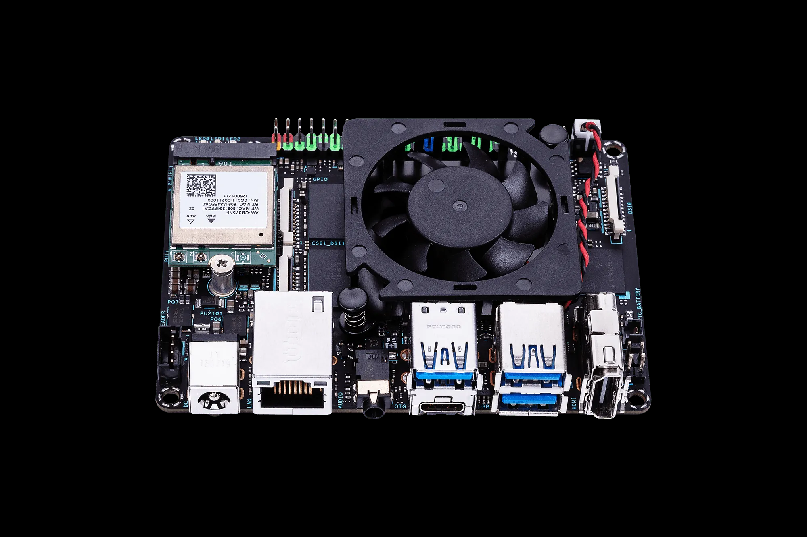
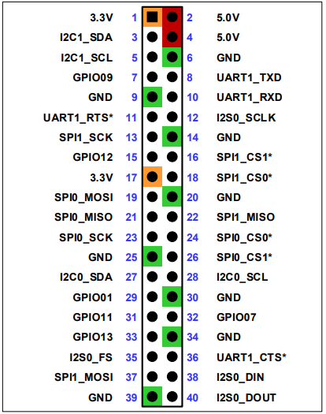
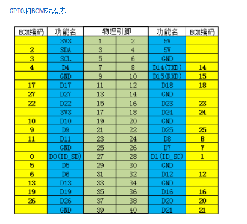
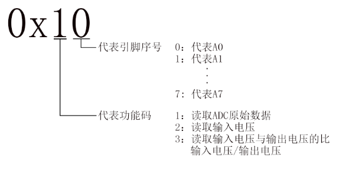

适用于Jetson Orin NANO和RK3399 Pro芯片的传感器驱动库。

## Jetson Orin NANO 芯片测试单片机


[Jetson Orin NANO 3D Printer Model](JetsonOrinNANO.stl)

## RK3399 Pro芯片测试单片机


## 基本原理

下图中，1、2、3到40 为拓展板的BOARD编号



从上图我们可以知道，40个Pin脚中有12个是正负极，只有28个是GPIO引脚。

所以我们把这28个物理引脚的编号与GPIO编号进行映射：



我们可以看到，管脚BOARD编号为32，它的BCM编号为12，因此下面的两组代码实现相同的功能：

```python
import RPi.GPIO as GPIO
import time
# 关闭GPIO警告信息（使用与默认不一致会发出警告）
GPIO.setwarnings(False)

def out_high(pin,types=GPIO.BCM):
    GPIO.setmode(types)
    GPIO.setup(32, GPIO.OUT) # 设为输出
    GPIO.output(32, GPIO.HIGH) # 设为高电平

out_on(32,GPIO.BOARD) # 未接接传感器拓展板
out_on(12,GPIO.BCM) # 下文中传感器拓展板的编号与BCM编号一致
```
## 拓展板


在终端输入`sudo i2cdetect -y 总线编号`命令，即可扫描接在I2C总线上的所有I2C设备，并打印出该设备的I2C总线地址，且我们的扩展板的I2C地址为0x24。

下面的示例表示查询总线0、1 ...7 下的 i2c 设备：
```
sudo i2cdetect -y 0

sudo i2cdetect -y 1

....

sudo i2cdetect -y 7
```

出现下面的输出表示找到了拓展板，记住这个总线编号（Jetson Orin NANO 一般是7）


### 配置I2C总线速度

```bash

# 编辑config.txt文件设置树莓派IIC总线速度
sudo vim /boot/config.txt

# 添加以下内容

dtparam=i2c_arm=on,i2c_arm_baudrate=100000

# 重启
sudo reboot

```

### 读取ADC模拟值
众所周知，没有ADC不能直接读取传感器的模拟值。在扩展板内置的MCU STM32的帮助下可以读取12位ADC这就意味着可以在树莓派上使用模拟传感器，且一共有8个可用的接口。

    模拟传感器将模拟电压输入12位模数转换器。模数转换器将模拟数据转换成数字数据后，通过I2C将数字数据输入到主控中。




```python
import time
import smbus as smbus

subline = 7   #填写我们之前记住的总线编号
subpin = 0x24 # 0x24表示我们总线编号中输出的地址
adcpin = 0x10 # 0x10表示我们的寄存器地址（对应拓展板的A0，如果你想读取A1-A7，或者想读取电压而非值，参考上图）

ADC=smbus.SMBus(subline)

while True:
    ADC.write_byte(subpin, adcpin)# 写入A0
    print(ADC.read_word_data(subpin, adcpin))#读取A0
    time.sleep(1)#
```


## 彩灯与NFC


NFC可以使用现成的MFRC522模块库，我们的卡是16个分区，对应blockAddr是0-15，其中0号分区不用

RGB彩灯硬件中定义首位字节，通过I2C传输，代码如下：

```python
class RC522:
    def __init__(self):
        i2cBus = 7
        i2cAddress = 0x28
        self.MFRC522Reader = MFRC522(i2cBus, i2cAddress)

    def scan(self):
        (status, backData, tagType) = self.MFRC522Reader.scan()
        if status == self.MFRC522Reader.MIFARE_OK:
            print(f'Card detected, Type: {tagType}')

            # Get UID of the card
            (status, uid, backBits) = self.MFRC522Reader.identify()
            if status == self.MFRC522Reader.MIFARE_OK:
                return (tagType, uid)
            else:
                return (tagType, None)
        
        return (None, None)

    def read (self, uid:list, blockAddr:int):
        # Select the scanned card
        (status, backData, backBits) = self.MFRC522Reader.select(uid)
        if status == self.MFRC522Reader.MIFARE_OK:
            # Authenticate
            (status, backData, backBits) = self.MFRC522Reader.authenticate(
                self.MFRC522Reader.MIFARE_AUTHKEY1,
                blockAddr,
                self.MFRC522Reader.MIFARE_KEY,
                uid)
            if (status == self.MFRC522Reader.MIFARE_OK):
                # Read data from card
                (status, backData, backBits) =self.MFRC522Reader.read(
                    blockAddr)
                if (status == self.MFRC522Reader.MIFARE_OK):
                    return backData
                else:
                    print("read: read error")
                    return None
                self.MFRC522Reader.deauthenticate()
            else:
                print("read: Authenticate error")
        else:
            print("read: card miss")

    def write(self, blockAddr:int, data:list = [0, 0, 0, 0, 0, 0, 0, 0, 0, 0, 0, 0, 0, 0, 0, 0]):
        """
        blockAddr: 1-15
        data:list = [0, 0, 0, 0, 0, 0, 0, 0, 0, 0, 0, 0, 0, 0, 0, 0]
        """
        return self.MFRC522Reader.write(blockAddr, data)

class RGB:

    def __init__(self):
        pass

    def set(self,data):
        data = data + [0]*(24*3 - len(data))
        with smbus2.SMBus(7) as bus:
            msg = smbus2.i2c_msg.write(0x24, [200]+data+[99])
            bus.i2c_rdwr(msg)

    def close(self):
        with smbus2.SMBus(7) as bus:
            msg = smbus2.i2c_msg.write(0x24, [200]+[0,0,0]*24+[99])
            bus.i2c_rdwr(msg)
```

## 如何调用传感器？

我们通过 Python 代码来操作传感器，比如摄像头、温度传感器等。这些传感器可以帮助我们获取环境信息，从而做出相应的决策。

其中除摄像头外的传感器，我们使用的是 I2C 协议。I2C 协议是一种串行总线，可以同时连接多个设备。我们通过 I2C 协议来读取传感器的数据。相关代码必须使用`sudo`权限运行。


详细的调用方法可以参考末尾的接口说明文档部分，这里主要讲解一些简单的示例与注意事项。


### 1. 导入模块

```python
sudo pip3 install 'exboard>=1.0.3'

```

在使用函数的时候我们通过 `import` 关键字导入指定的模块， 或者使用 `from 模块名 import 函数/类/方法名` 导入：

```python
from exboard import FlameSensor
from exboard import MQGasSensor
from exboard import PhotosensitiveSensor
from exboard import RGB
from exboard import Ultrasound
from exboard import SoundSensor
from exboard import Servos
from exboard import RotaryPotentionmeter
```

### 2. 实例化传感器

下面这段名为`sensor.py`的代码导入了气体、光敏、声音、超声波传感器，然后通过实例化的对象调用`read`方法获取传感器的数据。

注意的点是：数据的获取是通过`read`方法获取的，想要持续获取数据，需要使用循环。另外记得加上`time.sleep`，否则会出现数据获取过快看不清的情况。

```python title="sensor.py"
from exboard import MQGasSensor
from exboard import PhotosensitiveSensor
from exboard import Ultrasound
from exboard import SoundSensor
import time

sensor2 = MQGasSensor()
sensor3 = PhotosensitiveSensor()
sound4 = SoundSensor()
us = Ultrasound()
while True:
    a2 = sensor2.read()
    a3 = sensor3.read()
    a4 = sound4.read()
    dist = us.read()
    print(
        "气体{} 光敏{} 声音{} 超声波{} ".format(
            a2,
            a3,
            a4,
            dist,
        )
    )
    time.sleep(0.2)
```

### 3.执行代码

你之间已经学习了终端相关的基础知识，现在可以通过`cd`命令切换到你的工作目录，然后执行`python`命令来运行你的代码。

下面是一个基础示例，其中空格是有意义的，养成习惯，不要多敲或少敲:

`sudo` 是一个用于提升权限的命令，因为我们的代码需要操作硬件，所以需要提升权限。  
`python3 sensor.py` 是执行代码的命令。表示使用 python 来执行 sensor.py 文件

```shell
sudo python3 sensor.py
```


所有涉及到摄像头以外的传感器的代码都需要使用`sudo`权限运行。


### 4. 结果

执行代码后，你会看到传感器的数据不断地在终端中打印出来。

## 接口说明文档

RaspberryPi-Sensor-Board 定制接口扩展板

RaspberryPi-Sensor-Board 接口扩展板的所有连接口均已焊接固定，无需进行插拔操作。以下是接口的详细说明：

| 传感器名称                 | 接口 1   | 接口 2   | 调用方法                             |
| -------------------------- | -------- | -------- | ------------------------------------ |
| 灯环                       | D9       | D10      | RGB                                  |
| NFC                        | SDA      | SCL      | RC522                                |
| 声音传感器                 | A0       | D22      | SoundSensor                          |
| 空气质量传感器(旧版)       | A1       | D23      | MQGasSensor                          |
| 空气质量传感器(新版)       | A2       | D24      | MQGasSensor                          |
| 光敏传感器                 | A4       |          | PhotosensitiveSensor                 |
| 超声波传感器               | D4(trig) | D5(echo) | Ultrasound                           |
| 摄像头云台 X 轴            | D12      |          | servos                               |
| 摄像头云台 Y 轴            | D13      |          | servos                               |
| 摄像头云台 灯珠            | D14      |          | LED                                  |
| 左旋钮                     | A5       |          | RotaryPotentionmeter                 |
| 右旋钮                     | A6       |          | RotaryPotentionmeter                 |
| 左按钮                     | D25      |          | GPIO                                 |
| 中按钮                     | D26      |          | GPIO                                 |
| 右按钮                     | D27      |          | GPIO                                 |
| 自由拓展口左上(1 号拓展口) | D16      |          | 由传感器决定                         |
| 自由拓展口右上(2 号拓展口) | D17      |          | 由传感器决定                         |
| 自由拓展口右下(3 号拓展口) | D18      |          | 由传感器决定                         |
| 自由拓展口左下(4 号拓展口) | A7       |          | 由传感器决定                         |
| 自由拓展口中间(5 号拓展口) | A3       |          | 由传感器决定 RK3390与左按钮共享 D25 信号线 |

其中空气质量传感器可能是连接的`A1| D23` 也可能是`A2| D24`，具体连接的是哪个传感器，可以通过查阅 MQGasSensor 方法，输入不同的接口组合观察有无数据来判断。

`自由拓展口中间` 使用的是`A3| D25`，其中 D25 为与左按钮共享信号线，假设您将`火焰传感器`接入`自由拓展口中间`,该传感器有 GVAD 四个针脚，A 可以返回火焰大小，D 可以返回有无火焰。

以下两种情况均会在 D25 产生信号。

- 按下左按钮开关
- 火焰传感器检测到有火源

### GPIO

此类用于处理通用输入/输出（GPIO）引脚。它接收一个引脚编号和其他参数`'out'`或`'in'`，并返回一个 `periphery.GPIO` 对象。`periphery.GPIO` 可进行的操作有：

- write(value)：写入一个布尔值
- read()：读取当前引脚的值

示例：

```python
gpio17 = GPIO(17, 'out')
gpio17.write(True) # 通电
gpio17.write(False) # 断电

gpio18 = GPIO(18, 'in')
gpio18.read()
```

### ADC

此类用于处理模拟到数字转换器（ADC）。它接收一个引脚编号，并创建一个 `I2C` 对象来读取 ADC 的值。它有一个方法 `read`，用于读取 ADC 的当前值。

示例：

```python
adc = ADC(0)
value = adc.read()
print(value)
```

### LED

此类用于处理一个 LED。它接收一个引脚编号，并创建一个 `GPIO` 对象来控制 LED。它有两个方法：`on` 和 `off`，用于打开和关闭 LED。

示例：

```python
led = LED(17)
led.on()
led.off()
```

### RC522

此类用于处理 RC522 RFID 读卡器。它有两个方法：`scan` 和 `read`。`scan` 方法用于扫描 RFID 卡，`read` 方法用于读取已扫描到的 RFID 卡的数据。

示例：

```python
rc522 = RC522()
tagType, uid = rc522.scan()
if uid:
    data = rc522.read(uid, 8)
    print(data)
```

### RGB

此类用于处理 RGB LED 灯带。它有两个方法：`set` 和 `send_frame`。`set` 方法接收一个颜色列表，并将其发送到 LED 灯带。`send_frame` 方法用于发送一个完整的帧到 LED 灯带。

示例：

```python
rgb = RGB()
rgb.set([(255, 0, 0), (0, 255, 0), (0, 0, 255)])
```

### Ultrasound

此类用于处理超声波传感器。它接收触发引脚和回声引脚的编号，并创建两个 `GPIO` 对象来控制这两个引脚。它有一个方法 `read`，用于读取超声波传感器的当前距离,数值单位为厘米。

示例：

```python
ultrasound = Ultrasound(4, 5)
distance = ultrasound.read()
print(distance)
```

### SoundSensor

此类用于处理声音传感器。它接收一个模拟引脚和一个数字引脚的编号，并创建一个 `GPIO` 对象和一个 `ADC` 对象来控制这两个引脚。它有一个方法 `read`，用于读取声音传感器的当前状态（有无声音）和值（声音大小）。

示例：

```python
sound_sensor = SoundSensor(0, 22)
signal, value = sound_sensor.read()
print(signal, value)
```

### PhotosensitiveSensor

此类用于处理光敏传感器。它接收一个模拟引脚的编号，并创建一个 `ADC` 对象来读取该引脚的值。它有一个方法 `read`，用于读取光敏传感器的当前值。

示例：

```python
photosensitive_sensor = PhotosensitiveSensor(4)
value = photosensitive_sensor.read()
print(value)
```

### SoilMoistureSensor

此类用于处理土壤湿度传感器。它接收一个模拟引脚的编号，并创建一个 `ADC` 对象来读取该引脚的值。它有一个方法 `read`，用于读取土壤湿度传感器的当前值。

示例：

```python
soil_moisture_sensor = SoilMoistureSensor(5)
value = soil_moisture_sensor.read()
print(value)
```

### WaterDepthSensor

此类用于处理水深传感器。它接收一个模拟引脚的编号，并创建一个 `ADC` 对象来读取该引脚的值。它有一个方法 `read`，用于读取水深传感器的当前值。

示例：

```python
water_depth_sensor = WaterDepthSensor(7)
value = water_depth_sensor.read()
print(value)
```

### FlameSensor

此类用于处理火焰传感器。它接收一个模拟引脚和一个数字引脚的编号，并创建一个 `GPIO` 对象和一个 `ADC` 对象来控制这两个引脚。它有一个方法 `read`，用于读取火焰传感器的当前状态（有无火焰）和值（火焰大小）。

示例：

```python
flame_sensor = FlameSensor(2, 24)
signal, value = flame_sensor.read()
print(signal, value)
```

### RotaryPotentionmeter

此类用于处理旋转电位器。它接收一个模拟引脚的编号，并创建一个 `ADC` 对象来读取该引脚的值。它有一个方法 `read`，用于读取旋转电位器的当前值。

示例：

```python
rotary_potentionmeter = RotaryPotentionmeter(6)
value = rotary_potentionmeter.read()
print(value)
```

### MQGasSensor

此类用于处理 MQ 系列的气体传感器。它接收一个模拟引脚和一个数字引脚的编号，并创建一个 `GPIO` 对象和一个 `ADC` 对象来控制这两个引脚。它有一个方法 `read`，用于读取气体传感器的当前状态（有无气体）和值（气体浓度）。

示例：

```python
mq_gas_sensor = MQGasSensor(1, 23)
signal, value = mq_gas_sensor.read()
print(signal, value)
```

### Servo


建议使用 `Servos` 类来控制伺服电机。

此类用于处理伺服电机。它接收一个芯片编号和一个通道编号，并创建一个 `PWM` 对象来控制伺服电机。它有两个方法：`high_duration` 和 `update`。`high_duration` 方法用于设置 PWM 的高电平持续时间。`update` 方法用于更新伺服电机的角度。
示例：

```python
servo = Servo(0, 0)
servo.update(45)
```

### Servos

此类用于处理两个伺服电机。它创建了两个 `Servo` 对象，分别用于控制 X 轴和 Y 轴的伺服电机。它有两个方法：`update_x` 和 `update_y`，用于更新 X 轴和 Y 轴伺服电机的角度。

示例：

```python
servos = Servos()
servos.update_x(45)
servos.update_y(30)
```
