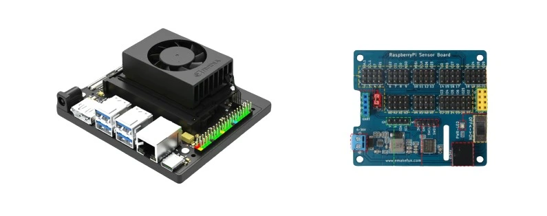

# Overview

This is a hardware control library that has been verified to work with `Jetson Orin Nano` and `RK3399 Pro`

The system is Debian and automatically selects `RK3399 Pro`. In other cases, `Jetson Orin Nano` is used by default.

Since the main control board can only control the GPIO interface by default, in order to call more complex sensors, I connected an expansion board to unlock ADC & I2C. You can also design your own or choose other expansion boards.



[Jetson Orin NANO 3D Printer Model](JetsonOrinNANO.stl)

## Features

- Digital reading and writing and analog reading.

- Supports a variety of sensors: ultrasonic, RGB light strip, NFC, USB gimbal, button knob, etc.

- Clean and simple API.

## Sensor list

Here are some sensors, the pin numbers of the expansion board I connected, and the class names of the corresponding control codes. There are usage instructions for the corresponding classes at the bottom.

| Sensor Name                     | Interface 1 | Interface 2 | Calling Method                     |
| ------------------------------- | ----------- | ----------- | ---------------------------------- |
| LED                             | D9          | D10         | RGB                                |
| NFC                             | SDA         | SCL         | RC522                              |
| Sound Sensor                    | A0          | D22         | SoundSensor                        |
| Air Quality Sensor              | A2          | D24         | MQGasSensor                        |
| Photosensitive Sensor           | A4          |             | PhotosensitiveSensor               |
| Ultrasonic Sensor               | D4 (trig)   | D5 (echo)   | Ultrasound                         |
| Camera Pan-Tilt X Axis          | D12         |             | servos                             |
| Camera Pan-Tilt Y Axis          | D13         |             | servos                             |
| Camera Pan-Tilt LED             | D14         |             | LED                                |
| Left Knob                       | A5          |             | RotaryPotentionmeter               |
| Right Knob                      | A6          |             | RotaryPotentionmeter               |
| Left Button                     | D25         |             | GPIO                               |
| Middle Button                   | D26         |             | GPIO                               |
| Right Button                    | D27         |             | GPIO                               |
| Free Expansion Port Upper Left  | D16         |             | Determined by sensor               |
| Free Expansion Port Lower Left  | A7          |             | Determined by sensor               |
| Free Expansion Port Middle      | A3          | D25         | Shares D25 signal with left button |
| Free Expansion Port Upper Right | D17         |             | Determined by sensor               |
| Free Expansion Port Lower Right | D18         |             | Determined by sensor               |


## How to Call Sensors?

### 1. Import Modules

The latest version is Version: 1.0.8

```python
sudo pip3 install exboard==1.0.8
```

```python
from exboard import *
```

### 2. Instantiate Sensors

The following code, named `sensor.py`, imports gas, photosensitive, sound, and ultrasonic sensors, and then calls the `read` method to get the sensor data through the instantiated objects.

Note: Data is obtained through the `read` method. To continuously acquire data, you need to use a loop. Also, remember to add `time.sleep` to avoid data retrieval being too fast to be readable.

```python title="sensor.py"
from exboard import *
import time

sensor2 = MQGasSensor()
sensor3 = PhotosensitiveSensor()
sound4 = SoundSensor()
us = Ultrasound()
while True:
    a2 = sensor2.read()
    a3 = sensor3.read()
    a4 = sound4.read()
    dist = us.read()
    print(
        "Gas {} Photosensitive {} Sound {} Ultrasound {} ".format(
            a2,
            a3,
            a4,
            dist,
        )
    )
    time.sleep(0.2)
```

### 3. Execute Code

You have already learned the basics of the terminal. Now you can use the `cd` command to switch to your working directory and then run your code with the `python` command.

Here is a basic example. Note that spaces are meaningful, so make it a habit not to add or remove any:

`sudo` is a command used to elevate permissions, as our code needs to operate hardware, it requires elevated permissions.  
`python3 sensor.py` is the command to execute the code, indicating that Python is used to run the sensor.py file.

```shell
sudo python3 sensor.py
```

All code involving sensors other than the camera needs to be run with `sudo` privileges.

### 4. Results

After executing the code, you will see the sensor data continuously printed in the terminal.

### GPIO

This class is used to handle general-purpose input/output (GPIO) pins. It receives a pin number and other parameters `'out'` or `'in'`, and returns a `periphery.GPIO` object. Operations that can be performed on `periphery.GPIO` include:

- `write(value)`: Write a boolean value
- `read()`: Read the current value of the pin

Example:

```python
gpio17 = GPIO(17, 'out')
gpio17.write(True) # Power on
gpio17.write(False) # Power off

gpio18 = GPIO(18, 'in')
gpio18.read()
```

### ADC

This class is used to handle Analog to Digital Converters (ADC). It receives a pin number and creates an `I2C` object to read the ADC's value. It has a method `read` to read the current value of the ADC.

Example:

```python
adc = ADC(0)
value = adc.read()
print(value)
```

### LED

This class is used to handle an LED. It receives a pin number and creates a `GPIO` object to control the LED. It has two methods: `on` and `off` to turn the LED on and off.

Example:

```python
led = LED(17)
led.on()
led.off()
```

### RC522

This class is used to handle the RC522 RFID reader. It has two methods: `scan` and `read`. The `scan` method scans for RFID cards, and the `read` method reads data from the scanned RFID card.

Example:

```python
rc522 = RC522()
tagType, uid = rc522.scan()
if uid:
    data = rc522.read(uid, 8)
    print(data)
```

### RGB

This class is used to handle RGB LED strips. It has two methods: `set` and `send_frame`. The `set` method receives a list of colors and sends them to the LED strip. The `send_frame` method sends a complete frame to the LED strip.

Example:

```python
rgb = RGB()
rgb.set([(255, 0, 0), (0, 255, 0), (0, 0, 255)])
rgn.close()
```

### Ultrasound

This class is used to handle ultrasonic sensors. It receives the pin numbers for the trigger and echo pins and creates two `GPIO` objects to control these pins. It has a method `read` to read the current distance from the ultrasonic sensor, with the value in centimeters.

Example:

```python
ultrasound = Ultrasound(4, 5)
distance = ultrasound.read()
print(distance)
```

### SoundSensor

This class is used to handle sound sensors. It receives the pin numbers for an analog pin and a digital pin and creates a `GPIO` object and an `ADC` object to control these pins. It has a method `read` to read the current state (presence of sound) and value (sound level) from the sound sensor.

Example:

```python
sound_sensor = SoundSensor(0, 22)
signal, value = sound_sensor.read()
print(signal, value)
```

### PhotosensitiveSensor

This class is used to handle photosensitive sensors. It receives the pin number for an analog pin and creates an `ADC` object to read the value of the pin. It has a method `read` to read the current value from the photosensitive sensor.

Example:

```python
photosensitive_sensor = PhotosensitiveSensor(4)
value = photosensitive_sensor.read()
print(value)
```

### SoilMoistureSensor

This class is used to handle soil moisture sensors. It receives the pin number for an

analog pin and creates an `ADC` object to read the value of the pin. It has a method `read` to read the current value from the soil moisture sensor.

Example:

```python
soil_moisture_sensor = SoilMoistureSensor(5)
value = soil_moisture_sensor.read()
print(value)
```

### FlameSensor

This class is used to handle flame sensors. It receives the pin number for an analog pin and creates an `ADC` object to read the value of the pin. It has a method `read` to read the current value from the flame sensor.

Example:

```python
flame_sensor = FlameSensor(7)
value = flame_sensor.read()
print(value)
```

### TemperatureSensor

This class is used to handle temperature sensors. It receives the pin number for an analog pin and creates an `ADC` object to read the value of the pin. It has a method `read` to read the current value from the temperature sensor.

Example:

```python
temperature_sensor = TemperatureSensor(6)
value = temperature_sensor.read()
print(value)
```

### Servos

This class is used to handle servo motors. It receives the pin numbers for two PWM pins and creates `PWM` objects to control these pins. It has methods `set_angle` and `set_speed` to control the angle and speed of the servo motors.

Example:

```python
servos = Servos(12, 13)
servos.set_angle(90)
servos.set_speed(1)
```

### RotaryPotentionmeter

This class is used to handle rotary potentiometers. It receives the pin number for an analog pin and creates an `ADC` object to read the value of the pin. It has a method `read` to read the current value from the rotary potentiometer.

Example:

```python
rotary_potentiometer = RotaryPotentionmeter(5)
value = rotary_potentiometer.read()
print(value)
```
